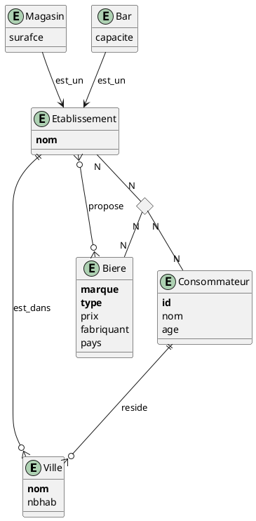

# TD2

### Exercice 1. Bars à bières : Schéma


```plsql
create type Ville as object (
	nom varchar2(30),
	nbhav number(6)
);
/
create type Etablissement as object{
	nom varchar2(30),
	bareire varchar2(30),
	dans REF Ville,
	propose REF Biere
};
/
create type EnsBiere as table of REF Biere;
/
create type Magasin under Etablissement(
	surface Number(4)
);
/
create type bar under Etablissement(
	capacite Number(4)
);
/
create type Consommateur as object(
	id number(10),
	nom varchar2(30),
	age number(3),
	reside REF Ville,
	consommation EnsConsomme
);
/
create type Consomme as object(
	lieu REF Etablissement,
	produit REF Biere,
);
/
create type EnsConsomme as table of Consomme;
/

```

