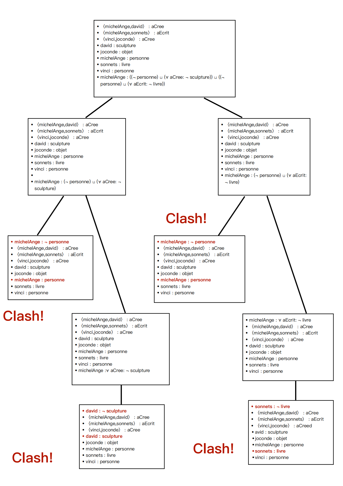

# PROJET DE LOGIQUE ET REPRESENTATION DES CONNAISSANCES
Master informatique - Sorbonne Université
2022-2023, M1 S1

### Binome:
​    Shuyuan LUO
​    Maxence MAIRE

## Execution du projet: 

- lancer Prolog
- ouvrir chacun des fichiers du projet en mode 'consult'
- entrer le predicat 'programme.'
- suivre les instructions qui s'affichent progressivement

## Test pour proposition : **michelAnge: and(sculpteur,auteur)**

Les mots en gras indiquent ce qu'il faut saisir.

```
(base) luoshuyuan@luoshuyuandeMacBook-Pro LRC % **swipl**
Welcome to SWI-Prolog (threaded, 64 bits, version 8.4.3)
SWI-Prolog comes with ABSOLUTELY NO WARRANTY. This is free software.
Please run ?- license. for legal details.

For online help and background, visit https://www.swi-prolog.org
For built-in help, use ?- help(Topic). or ?- apropos(Word).

**?- ['test.pl'].**
true.

**?- programme.**

Tbox : [(auteur,and(personne,some(aEcrit,livre))),(editeur,and(personne,and(all(aEcrit,not(livre)),some(aEdite,livre)))),(parent,and(personne,some(aEnfant,anything))),(sculpteur,and(personne,some(aCree,sculpture)))]AboxIR : [(david,sculpture),(joconde,objet),(michelAnge,personne),(sonnets,livre),(vinci,personne)]AboxIRR[(michelAnge,david,aCree),(michelAnge,sonnets,aEcrit),(vinci,joconde,aCree)]

Entrez  le  numero  du  type  de  proposition  que  vous  voulez demontrer :1 Une instance donnee appartient a un concept donne.2 Deux concepts n"ont pas d"elements en commun(ils ont une intersection vide).

|: **1.**

Entrer le concept et l"instance en [I,C].

|: **[michelAnge, and(sculpteur,auteur)].**

Abox ins = [(david,sculpture),(joconde,objet),(michelAnge,personne),(sonnets,livre),(vinci,personne),(michelAnge,or(or(not(personne),all(aCree,not(sculpture))),or(not(personne),all(aEcrit,not(livre)))))]
Abox relation = [(michelAnge,david,aCree),(michelAnge,sonnets,aEcrit),(vinci,joconde,aCree)]
Abe = [(michelAnge,david,aCree),(michelAnge,sonnets,aEcrit),(vinci,joconde,aCree),(david,sculpture),(joconde,objet),(michelAnge,personne),(sonnets,livre),(vinci,personne),(michelAnge,or(or(not(personne),all(aCree,not(sculpture))),or(not(personne),all(aEcrit,not(livre)))))]

previous Abe
〈michelAnge,david〉 : aCree
〈michelAnge,sonnets〉 : aEcrit
〈vinci,joconde〉 : aCree
david : sculpture
joconde : objet
michelAnge : personne
sonnets : livre
vinci : personne
michelAnge : ((¬ personne) ⊔ (∀ aCree: ¬ sculpture)) ⊔ ((¬ personne) ⊔ (∀ aEcrit: ¬ livre))


Or
branch 1
michelAnge : (¬ personne) ⊔ (∀ aCree: ¬ sculpture)〈michelAnge,david〉 : aCree
〈michelAnge,sonnets〉 : aEcrit
〈vinci,joconde〉 : aCree
david : sculpture
joconde : objet
michelAnge : personne
sonnets : livre
vinci : personne

collision between : michelAnge : personne and michelAnge : ¬ personne


branch 1 collided

michelAnge : ¬ personne
〈michelAnge,david〉 : aCree
〈michelAnge,sonnets〉 : aEcrit
〈vinci,joconde〉 : aCree
david : sculpture
joconde : objet
michelAnge : personne
sonnets : livrevinci : personne

branch 2
michelAnge : ∀ aCree: ¬ sculpture
〈michelAnge,david〉 : aCree
〈michelAnge,sonnets〉 : aEcrit
〈vinci,joconde〉 : aCree
david : sculpture
joconde : objet
michelAnge : personne
sonnets : livrevinci : personne


All
Evolution from Abox1
michelAnge : ∀ aCree: ¬ sculpture
〈michelAnge,david〉 : aCree
〈michelAnge,sonnets〉 : aEcrit
〈vinci,joconde〉 : aCree
david : sculpture
joconde : objet
michelAnge : personne
sonnets : livre
vinci : personne

To Abox2
david : ¬ sculpture
〈michelAnge,david〉 : aCree
〈michelAnge,sonnets〉 : aEcrit
〈vinci,joconde〉 : aCree
david : sculpture
joconde : objet
michelAnge : personne
sonnets : livre
vinci : personne


collision between : david : sculpture and david : ¬ sculpture

collision between : david : sculpture and david : ¬ sculpture

Collision exist here!!


Go back to branch 2
michelAnge : (¬ personne) ⊔ (∀ aEcrit: ¬ livre)〈michelAnge,david〉 : aCree
〈michelAnge,sonnets〉 : aEcrit
〈vinci,joconde〉 : aCree
david : sculpture
joconde : objet
michelAnge : personne
sonnets : livre
vinci : personne

collision between : michelAnge : personne and michelAnge : ¬ personne

collision between : michelAnge : personne and michelAnge : ¬ personne


branch 1 collided

michelAnge : ¬ personne
〈michelAnge,david〉 : aCree
〈michelAnge,sonnets〉 : aEcrit
〈vinci,joconde〉 : aCree
david : sculpture
joconde : objet
michelAnge : personne
sonnets : livre
vinci : personne

branch 2
michelAnge : ∀ aEcrit: ¬ livre
〈michelAnge,david〉 : aCree
〈michelAnge,sonnets〉 : aEcrit
〈vinci,joconde〉 : aCree
david : sculpture
joconde : objet
michelAnge : personne
sonnets : livre
vinci : personne


All
Evolution from Abox1
michelAnge : ∀ aEcrit: ¬ livre
〈michelAnge,david〉 : aCree
〈michelAnge,sonnets〉 : aEcrit
〈vinci,joconde〉 : aCree
david : sculpture
joconde : objet
michelAnge : personne
sonnets : livre
vinci : personne

To Abox2
sonnets : ¬ livre
〈michelAnge,david〉 : aCree
〈michelAnge,sonnets〉 : aEcrit
〈vinci,joconde〉 : aCreed
avid : sculpture
joconde : objet
michelAnge : personne
sonnets : livre
vinci : personne


collision between : sonnets : livre and sonnets : ¬ livre

collision between : sonnets : livre and sonnets : ¬ livre

Collision exist here!!
Youpiiiiii, on a demontre la proposition initiale !!!
true .
```

## Arbre construit selon l'affichage



