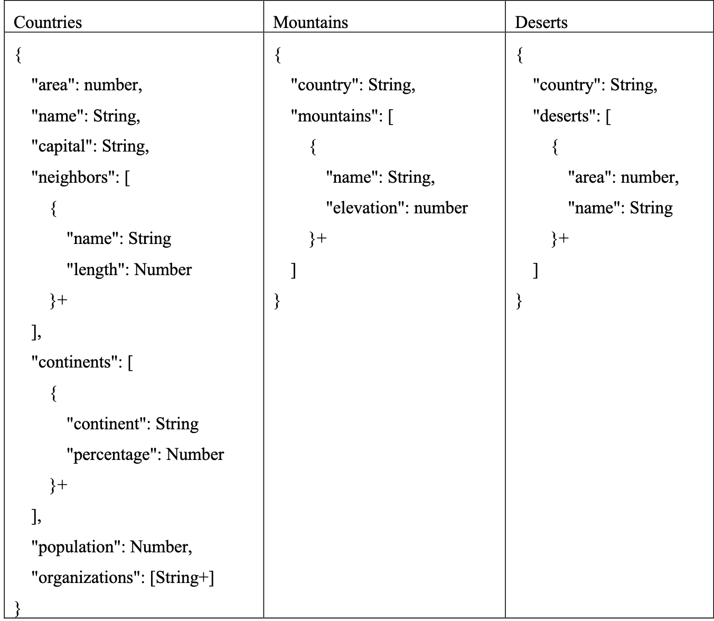

# N1QL 
## point important 
- Dans le `From`
	- `Unnest` : iterer sur les elements d'un array
		- equivalent a `table` dans  SQL3
		- cf. TD q6
	- `Join`
		-  Joindre plusieurs buckets (il faut définir des index):  
		```N1QL
		select r.`name` as river,  
		c.`name` as country  
		from `river`r join `country`c  
		on r.`@country` = c.`@car_code`  
		limit 2 
		=> 
		[{
			{"country": { "#": "China" },
			{"river": { "#": "Missouri" }
		},  
			{
				{"country": {"#": "United States" },
				{"river": { "#": "Hwangho" }
			}] 
		```
	- `nest ` : Regrouper les éléments dans un array (inverse de unnest , inverse de unnest
		-  nest creer un array et les regroupe ensemble , alors que join attribut la valeur correspondante mais ne creer pas de array
- `value` : retourne les valeurs des  objets au lieu des objets
	- `raw`, `element` sont des synonymes 
- `ANY / EVERY SATISFIES` : 
	- rmq : mettre un end a la fin et le variable n'existe que dans le clause
- `array-agg ` : pour construire un tableau
  - cf. q10
- constructeur de tableau : `ARRAY-FOR-IN-END`.
  - cf q9

	
## TD  NoSQL 
### N1QL

>1. Pour les pays ayant une population plus de 50 millions d'habitants, leur nom, population et le  
nombre d'organisations auxquelles ils appartiennent triés par ordre décroissant de population.  
Utiliser la fonction ARRAY_LENGTH() qui retourne la longueur d’un tableau.
```sql
select name, population,array_length(organizations)
From Countries 
where population > 50million
order by population desc
```
> 2. Les noms des pays qui se trouvent sur exactement deux continents et où la couverture sur l’un  
des continents dépasse 50%.  
Utiliser l'expression ANY-SATISFIES-END pour vérifier qu’au moins un élément d’un  
tableau vérifie une condition donnée.
```sql 
select 
From Countries 
where array.length(continent) =2 
And any c in continents satisfies c.percentage > 50 end 
```
**c est une variable definie , ici correspond a un tuple de 2 elements**
> 3. Les noms des pays dont toutes les frontières sont supérieures à 100 km.  
Utiliser l'expression EVERYY-SATISFIES-END pour vérifier que tous les éléments d’un tableau  
vérifient une condition donnée.
- toutes les frontieres > 100km 
- utiliser every 
```sql
select 
From Countries c 
where every n in neighbors satisfies n.length >100 end
```
> 4. Les pays qui ont à la fois un désert et une montagne. De telles pays ont leur nom qui figure  
dans les collections Deserts et Mountains.
- Intersection entre les pays ayant un 1 desert et  ceux ayant 1 montagne
```sql 
select country
from deserts 
intersect 
select country 
From mountains 
```
>5. Les pays qui ont une montagne mais pas de déserts.
```sql
select country
from mountains 
Except 
Select country 
from desert
```
#### applatissement des listes 
>6. Les noms des continents sans doublons.
- unnest : permet de extraire chaque element d'un ensemble comme dans sql3 avec `table`
```sql
Select distinct c.continent
From countries unnest continents as c
```
ici `c` est un tuple (continent , percentage)
>7. Les noms des organisations sans doublons.
```sql
select distinct o
From Countries unnest Organisations as o 
```
ici `o` de type string
> 8. Les montagnes (nom et hauteur) de la France.
```sql
select m
From Mountains unnest mountains as m
where country = 'France'

```
#### Restructuration 
> 9. Les noms des pays se trouvant sur plus d’un continent, avec la liste des noms de leurs  
continents, et le nombre de leurs voisins.  
Utiliser le constructeur de tableau ARRAY-FOR-IN-END.
```sql 
select name,  array c.continent for c in continents end as nomC, array.length(neighbors)
From countries 
where array.length(continents)>1 
```
>10 . Pour les organisations ayant plus de 4 pays, leurs noms, la liste des noms des pays membres  
ainsi que la somme des populations de ces pays.  
Utiliser la fonction qui construit un tableau de valeur de l’attribut passé en argument. Cette  
fonction est utilisée dans un requête avec group by.
- `array-agg ` : pour construire un tableau
```sql
Select o , sum(c.population) as s , array-agg(c.name) as liste-p
From Countries c unnest organization as o 
group by o 
having count(*) > 4
```
#### jointure 
- inner-join _  on 
> 11- Les noms des pays et leurs capitales avec la liste de leurs déserts
```sql 
select c.name , c.capital, array d1.name for d1 in d.deserts end
From Countries c inner join deserts d on (c.name = d.country)
```